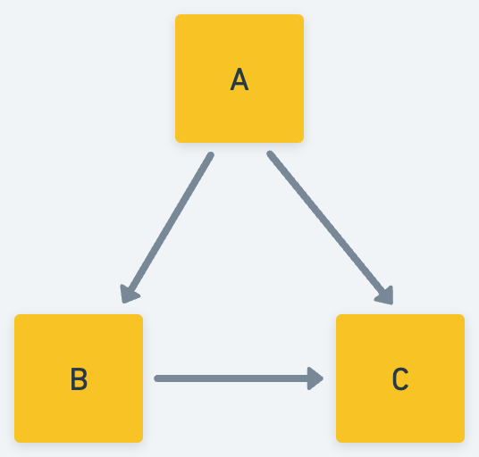
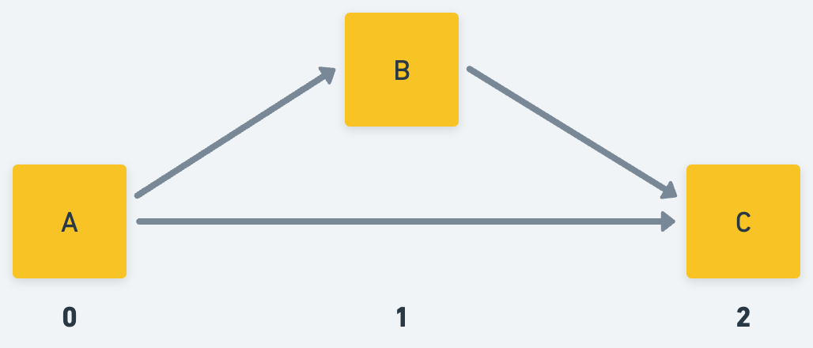
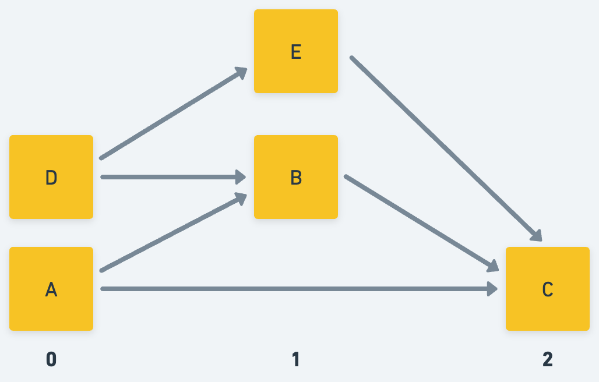

# StagedContractUpdates

> Enables pre-defined contract update deployments to a set of wrapped account at or beyond a specified block height. For
> more details about the purpose of this mechanism, see [FLIP 179](https://github.com/onflow/flips/pull/179)

## Simple Case Demo

For this run through, we'll focus on the simple case where a single contract is deployed to a single account that can
sign the setup & delegation transactions. 

This use case is enough to get the basic concepts involved in the `StagedContractUpdates` contract, but know that more
advanced deployments are possible with support for multiple contract accounts and customized deployment configurations.

### Setup

1. Start your local emulator:

    ```sh
    flow emulator
    ```

1. Setup emulator environment - this creates our emulator accounts & deploys contracts:

    ```sh
    sh setup.sh
    ```

### Walkthrough

1. We can see that the `Foo` has been deployed, and call its only contract method `foo()`, getting back `"foo"`:

    ```sh
    flow scripts execute ./scripts/foo.cdc
    ```

1. Configure `StagedContractUpdates.Updater`, passing the block height, contract name, and contract code in hex form (see
   [`get_code_hex.py`](./src/get_code_hex.py) for simple script hexifying contract code):
    - `setup_updater_single_account_and_contract.cdc`
        1. `blockUpdateBoundary: UInt64`
        1. `contractName: String`
        1. `code: [String]`

    ```sh
    flow transactions send ./transactions/setup_updater_single_account_and_contract.cdc \
        10 "Foo" 70756220636f6e747261637420466f6f207b0a202020207075622066756e20666f6f28293a20537472696e67207b0a202020202020202072657475726e2022626172220a202020207d0a7d \
        --signer foo
    ```

1. Simulate block creation, running transactions to iterate over blocks to the pre-configured block update height:

    ```sh
    sh tick_tock.sh
    ```

1. We can get details from our `Updater` before updating:

    ```sh
    flow scripts execute ./scripts/get_updater_info.cdc 0xe03daebed8ca0615
    ```

    ```sh
    flow scripts execute ./scripts/get_updater_deployment.cdc 0xe03daebed8ca0615
    ```

1. Next, we'll delegate the `Updater` Capability as `DelegatedUpdater` to the `Delegatee` stored in the `StagedContractUpdates`'s account.

    ```sh
    flow transactions send ./transactions/delegate.cdc --signer foo
    ```

1. Lastly, we'll run the updating transaction as the `Delegatee`:

    ```sh
    flow transactions send ./transactions/execute_delegated_updates.cdc
    ```

1. And we can validate the update has taken place by calling `Foo.foo()` again and seeing the return value is now
   `"bar"`

    ```sh
    flow scripts execute ./scripts/foo.cdc
    ```

## Multi-Account Multi-Contract Deployment

As mentioned above, `StagedContractUpdates` supports update deployments across any number of accounts & contracts.

Developers with a number of owned contracts will find this helpful as they can specify the order in which an update
should occur according to the contract set's dependency graph.

In our example, our dependency graph will look like this:



So the contracts should be updated in the following order:

```
[A, B, C]
```

This is because, assuming some breaking change prior to the update boundary, updating `C` before it's dependencies will
result in a failed deployment as contracts `A` & `B` are still in a broken state and cannot be imported when `C` is
updated.

However, since contract updates take effect **after** the updating transaction completes, we need to stage deployments
among updating transactions based on the depth of each contract in its dependency tree. 

More concretely, if we try to update all three contracts in the same transaction as above - `[A, B, C]` in sequence -
`B`'s dependency (`A`) will not have completed its update, causing `B`'s update attempt to fail.

Consequently, we instead batch updates based on the contract's maximum depth in the dependency graph. In our case,
instead of `[A, B, C]` we update `A` in one transaction, `B` in the next, and lastly `C` can be updated.



This concept can be extrapolated out for larger dependency graphs. For example, take the following:



This group of contracts would be updated over the same three stages, with each stage including contracts according to
their maximum depth in the dependency graph. In this case:

- Stage 0: `[A, D]`
- Stage 1: `[B, E]`
- Stage 2: `[C]`

Let's continue into a walkthrough with contracts `A`, `B`, and `C` and see how `StagedContractUpdates` can be configured to
execute these pre-configured updates.

### CLI Walkthrough

For the following walkthrough, we'll assume `A` is deployed on its own account while `B` & `C` are in a different
account.

:information_source: If you haven't already, perform the [setup steps above](#setup)

1. Since we'll be configuring an update deployment across a number of contract accounts, we'll need to delegate access
   to those accounts via AuthAccount Capabilities on each. Running the following transaction will link an AuthAccount
   Capability on the signer's account and publish it for the account where our `Updater` will live.

    ```sh
    flow transactions send ./transactions/publish_auth_account_capability.cdc \
        0xf669cb8d41ce0c74 \
        --signer a-account
    ```

    ```sh
    flow transactions send ./transactions/publish_auth_account_capability.cdc \
        0xf669cb8d41ce0c74 \
        --signer bc-account
    ```

    :information_source: Note we perform a transaction for each account hosting contracts we will be updating. This
    allows the `Updater` to perform updates for contracts across an arbitrary number of accounts.

1. Next, we claim those published AuthAccount Capabilities and configure an `Updater` resource that contains them along
   with our ordered deployment.
    - `setup_updater_multi_account.cdc`
        1. `blockUpdateBoundary: UInt64`
        1. `contractAddresses: [Address]`
        1. `deploymentConfig: [[{Address: {String: String}}]]`

    ```sh
    flow transactions send transactions/setup_updater_multi_account.cdc \
        --args-json "$(cat args.json)" \
        --signer abc-updater
    ```

    :information_source: Arguments are passed in Cadence JSON format since the values exceptionally long. Take a look at
    the transaction and arguments to more deeply understand what's being passed around.

1. You'll see a number of events emitted, one of them being `UpdaterCreated` with your `Updater`'s UUID. This means the
   resource was created, so let's query against the updater account to get its info.

    ```sh
    flow scripts execute ./scripts/get_updater_info.cdc 0xf669cb8d41ce0c74
    ```

    ```sh
    flow scripts execute ./scripts/get_updater_deployment.cdc 0xf669cb8d41ce0c74
    ```

1. Now we'll delegate a Capability on the `Updater` to the `Delegatee`:

    ```sh
    flow transactions send ./transactions/delegate.cdc --signer abc-updater
    ```

1. In the previous transaction we should see that the `UpdaterDelegationChanged` event includes the `Updater` UUID
   previously emitted in the creation event and that the `delegated` value is `true`. Now, we'll act as the `Delegatee`
   and execute the update.

    ```sh
    flow transactions send ./transactions/execute_delegated_updates.cdc
    ```

    This transaction calls `Updater.update()`, executing the first staged deployment, and updating contract `A`. Note
    that the emitted event contains the name and address of the updated contracts and that the `updateComplete` field is
    still `false`. This is because there are still incomplete deployment stages. Let's run the transaction again, this
    time updating `B`.

    ```sh
    flow transactions send ./transactions/execute_delegated_updates.cdc
    ```

    Now we see `B` has been updated, but we still have one more stage to complete. Let's complete the staged update.

    ```sh
    flow transactions send ./transactions/execute_delegated_updates.cdc
    ```

    And finally, we see that `C` was updated and `updateComplete` is now `true`.